# Практическая работа № 5

## Построение диаграммы деятельности организации в нотации DFD

**Тема:** 1.13. Разработка информационной системы "KinoYikes"

**Реализация подсистем:** Отдел закупок, Отдел продаж, Склад, Отдел кадров, Бухгалтерия

---

## Цели работы

1.1. Закрепить теоретические знания по принципам создания диаграммы деятельности.

1.2. Получить практические навыки по построению диаграммы деятельности в нотации DFD.

---

## Описание предметной области

**KinoYikes** — это сеть кинотеатров, которая организует показ фильмов и обеспечивает весь сопутствующий сервис: продажу билетов, работу баров и сувенирных лавок, проведение премьер и специальных мероприятий.

### Основные процессы организации:

1. **Закупка прав на фильмы и товаров** - менеджер по закупкам организует заказы у поставщиков
2. **Формирование расписания сеансов** - администратор создаёт расписание показов фильмов
3. **Продажа билетов** - кассиры продают билеты клиентам офлайн и онлайн
4. **Продажа сопутствующих товаров** - продажа попкорна, напитков, сувениров
5. **Управление складом** - учёт остатков товаров и их движение
6. **Бухгалтерский учёт** - финансовый учёт всех операций и расчёт зарплаты
7. **Управление персоналом** - найм, обучение и учёт сотрудников

---

## 1. Диаграмма AS-IS (текущее состояние процессов)

### 1.1. Контекстная диаграмма AS-IS (уровень A-0)

Контекстная диаграмма показывает систему как единое целое и её взаимодействие с внешними сущностями.

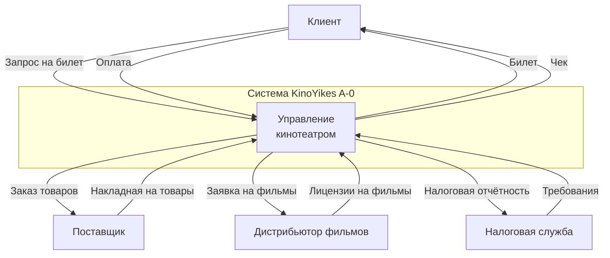

### 1.2. Диаграмма декомпозиции AS-IS (уровень A0)

Декомпозиция контекстной диаграммы на основные процессы первого уровня.

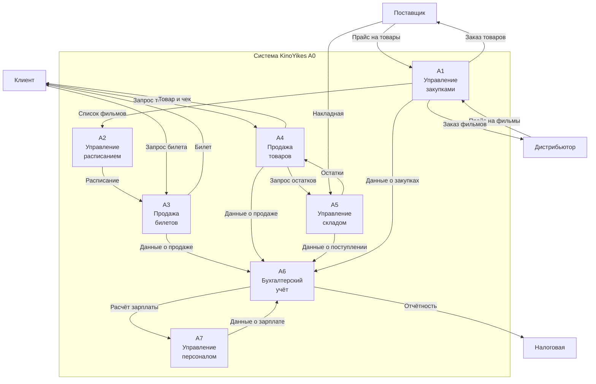

### 1.3. Детальная диаграмма процесса "Продажа билетов" (AS-IS A3)

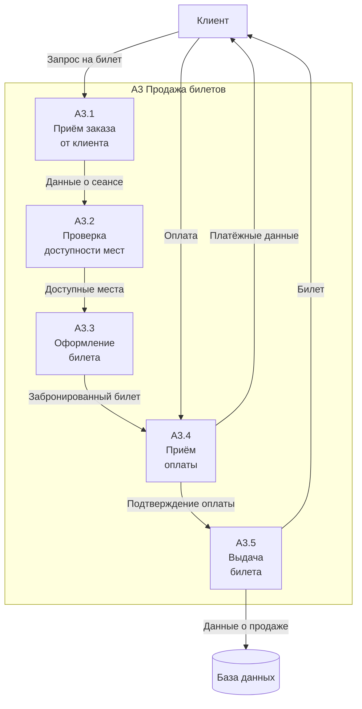

### 1.4. Детальная диаграмма процесса "Управление закупками" (AS-IS A1)

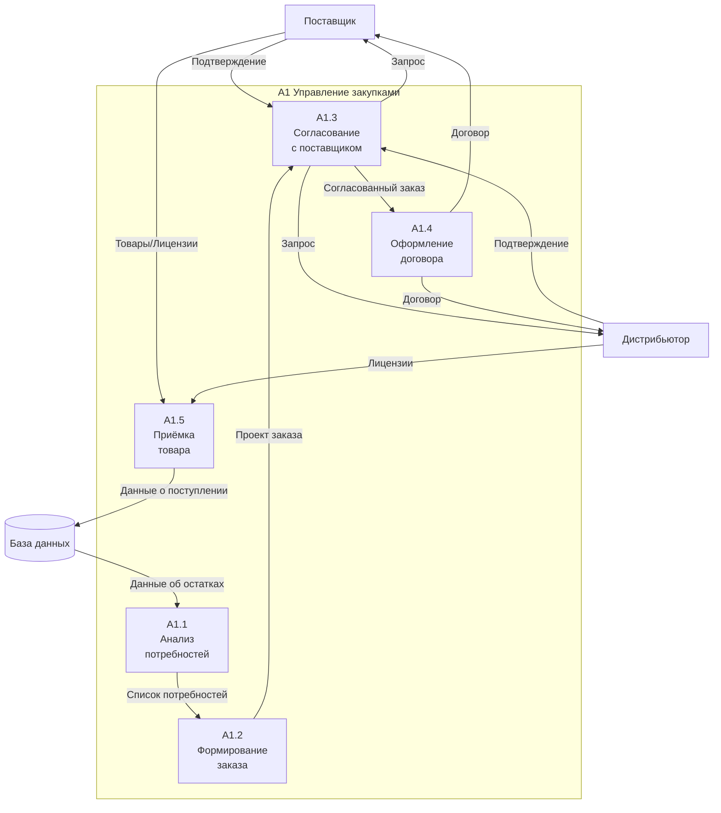

---

## 2. Диаграмма TO-BE (целевое состояние с автоматизацией)

### 2.1. Контекстная диаграмма TO-BE (уровень A-0)

После внедрения информационной системы процессы становятся автоматизированными.

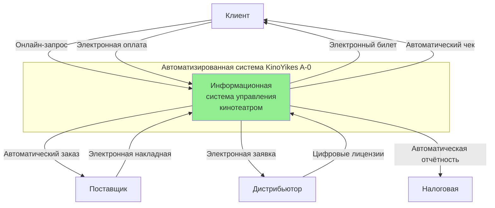

### 2.2. Диаграмма декомпозиции TO-BE (уровень A0)

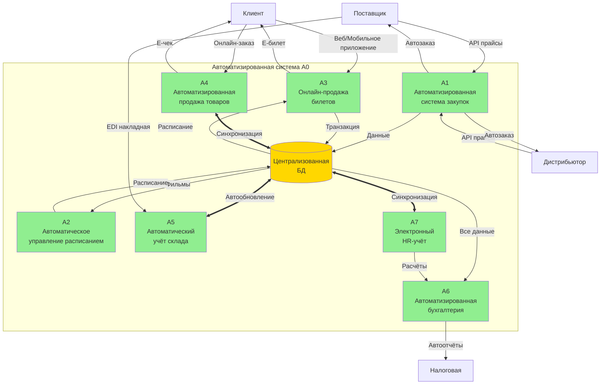

### 2.3. Детальная диаграмма "Онлайн-продажа билетов" (TO-BE A3)

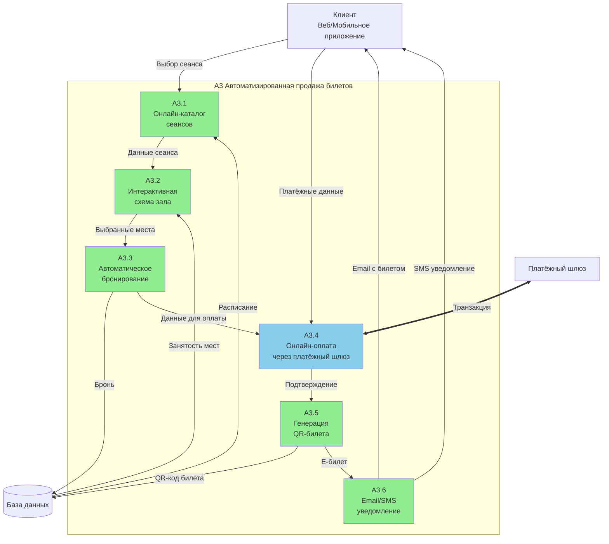

### 2.4. Детальная диаграмма "Автоматизированная система закупок" (TO-BE A1)

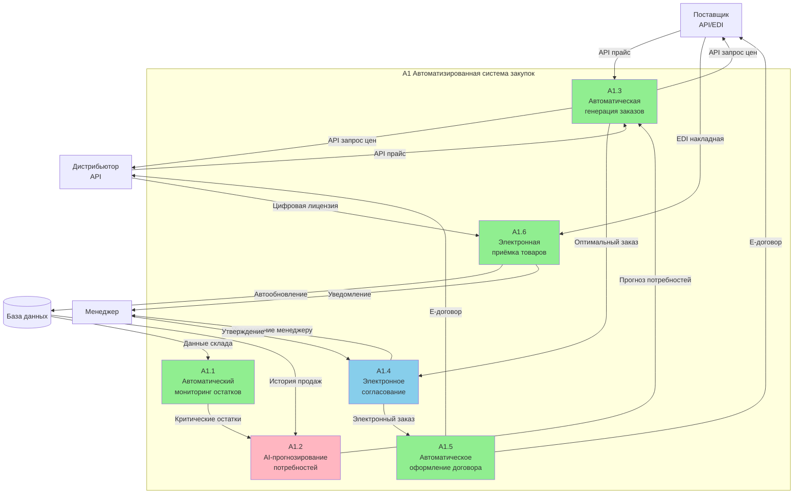

### 2.5. Диаграмма "Автоматизированная бухгалтерия" (TO-BE A6)

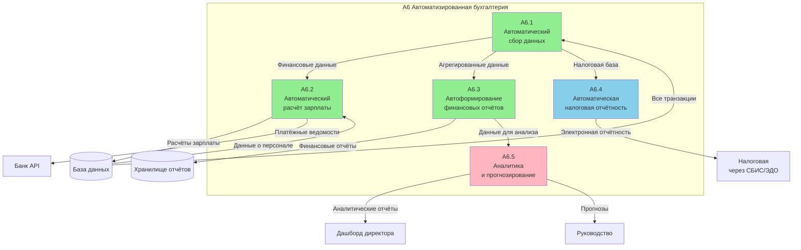

---

## 3. Сравнительный анализ AS-IS и TO-BE

### 3.1. Ключевые отличия

| **Процесс** | **AS-IS (текущее)** | **TO-BE (целевое)** | **Преимущества** |
|-------------|---------------------|---------------------|------------------|
| **Продажа билетов** | Ручная продажа через кассира | Онлайн-продажа с автоматическим бронированием | - Доступ 24/7 - Снижение очередей - Уменьшение ошибок |
| **Управление закупками** | Ручной анализ остатков и заказ | Автоматический мониторинг с AI-прогнозированием | - Оптимизация запасов - Предотвращение дефицита - Снижение издержек |
| **Складской учёт** | Ручной учёт в Excel | Автоматическая синхронизация с централизованной БД | - Реальное время - Исключение ошибок - Прозрачность |
| **Бухгалтерия** | Ручной ввод данных, расчёты в 1С | Автоматический сбор данных, автоотчёты | - Экономия времени - Точность расчётов - Аналитика в реальном времени |
| **HR-управление** | Бумажные документы, ручной учёт | Электронная система с автоматизацией | - Быстрый доступ к данным - Автоматический расчёт - История изменений |

### 3.2. Потоки данных

**AS-IS:**
- Преимущественно бумажные документы
- Дублирование данных
- Ручной перенос информации между отделами
- Задержки в обновлении информации

**TO-BE:**
- Цифровые потоки данных через API
- Единая централизованная база данных
- Автоматическая синхронизация
- Обновление в реальном времени

### 3.3. Хранилища данных

**AS-IS:**
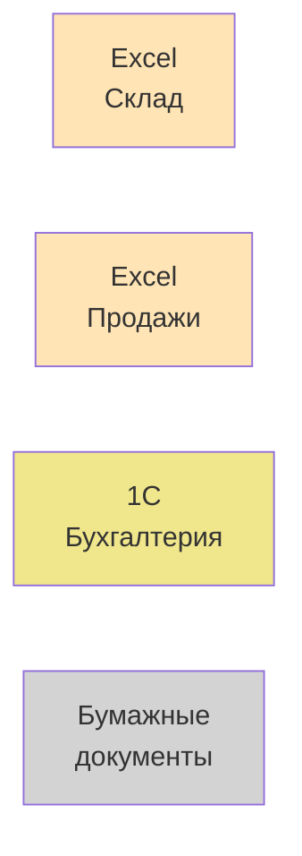

**TO-BE:**
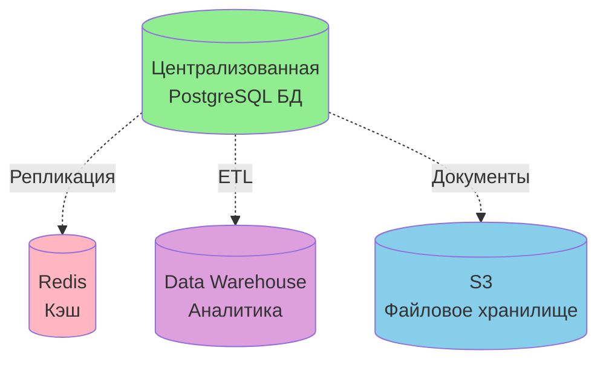

---

## 4. Детализация процессов TO-BE

### 4.1. Процесс онлайн-продажи билетов (подробно)

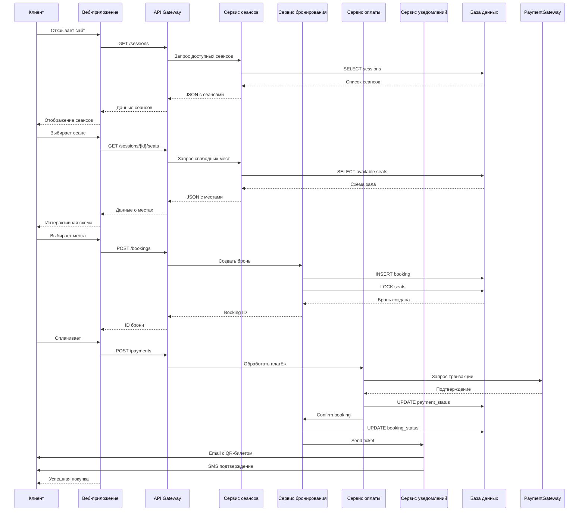

### 4.2. Процесс автоматической закупки

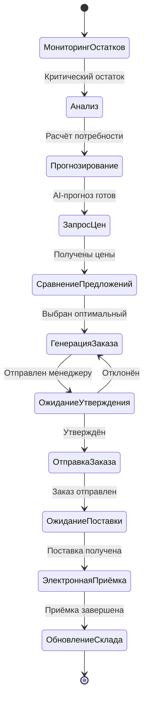

---

## 5. Технологический стек TO-BE

### 5.1. Архитектура системы

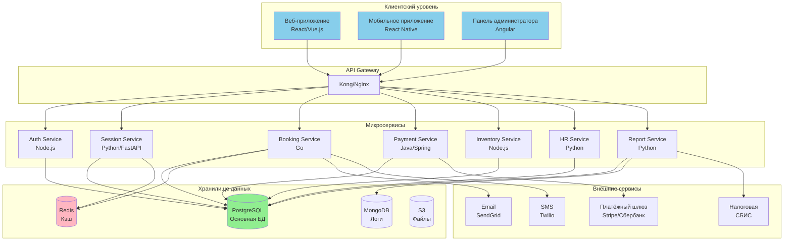

### 5.2. Используемые технологии

| **Компонент** | **Технология** | **Назначение** |
|---------------|----------------|----------------|
| **Frontend** | React, Vue.js, React Native | Клиентские приложения |
| **Backend** | Node.js, Python (FastAPI), Go, Java (Spring) | Микросервисы |
| **База данных** | PostgreSQL | Основное хранилище |
| **Кэш** | Redis | Кэширование частых запросов |
| **Очередь сообщений** | RabbitMQ / Kafka | Асинхронная обработка |
| **API Gateway** | Kong / Nginx | Маршрутизация запросов |
| **Мониторинг** | Prometheus, Grafana | Мониторинг системы |
| **Логирование** | ELK Stack (Elasticsearch, Logstash, Kibana) | Сбор и анализ логов |
| **CI/CD** | GitLab CI, Docker, Kubernetes | Автоматизация развёртывания |
| **Облачная платформа** | AWS / Azure / Yandex Cloud | Инфраструктура |

---

## 6. Преимущества внедрения автоматизированной системы (TO-BE)

### 6.1. Бизнес-преимущества

| **Показатель** | **AS-IS** | **TO-BE** | **Улучшение** |
|----------------|-----------|-----------|---------------|
| **Время продажи билета** | 5-10 минут (касса) | 2-3 минуты (онлайн) | ↓ 60-70% |
| **Доступность продаж** | 10:00-22:00 | 24/7 | ↑ 200% |
| **Ошибки в учёте** | 5-7% | < 0.1% | ↓ 98% |
| **Время формирования отчёта** | 2-4 часа | 5-10 секунд | ↓ 99% |
| **Затраты на персонал** | 100% | 60% | ↓ 40% |
| **Удовлетворённость клиентов** | 75% | 92% | ↑ 23% |
| **Оборачиваемость склада** | 12 дней | 7 дней | ↑ 71% |

### 6.2. Технические преимущества

✅ **Масштабируемость** - система легко масштабируется при росте нагрузки

✅ **Отказоустойчивость** - резервирование критических компонентов

✅ **Безопасность** - современные методы защиты данных (шифрование, аутентификация)

✅ **Интеграция** - простая интеграция с внешними системами через API

✅ **Мониторинг** - контроль работы системы в реальном времени

✅ **Аналитика** - сбор данных для принятия решений на основе фактов

### 6.3. Организационные преимущества

✅ **Прозрачность процессов** - все операции логируются и отслеживаются

✅ **Снижение человеческого фактора** - автоматизация рутинных операций

✅ **Улучшение клиентского опыта** - удобство и скорость обслуживания

✅ **Оптимизация ресурсов** - эффективное использование персонала и активов

✅ **Соответствие требованиям** - автоматическое выполнение регуляторных требований

---

## 7. План внедрения системы TO-BE

### 7.1. Этапы внедрения

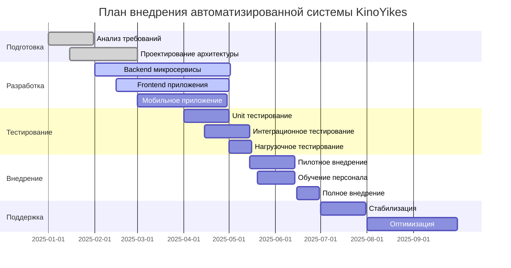

### 7.2. Риски и меры по их минимизации

| **Риск** | **Вероятность** | **Влияние** | **Меры минимизации** |
|----------|----------------|-------------|----------------------|
| Сопротивление персонала | Высокая | Среднее | Обучение, вовлечение в процесс |
| Технические проблемы при интеграции | Средняя | Высокое | Пилотное внедрение, резервные планы |
| Превышение бюджета | Средняя | Высокое | Поэтапное внедрение, контроль затрат |
| Недостаточная производительность | Низкая | Высокое | Нагрузочное тестирование, масштабирование |
| Проблемы с безопасностью данных | Низкая | Критическое | Аудит безопасности, шифрование, резервные копии |

---

## Выводы

В данной практической работе были получены практические навыки по построению диаграмм деятельности в нотации DFD и закреплены знания по принципам создания таких диаграмм.

### Основные достижения:

1. **Построена контекстная диаграмма AS-IS (A-0)**, показывающая текущее состояние системы управления кинотеатром как единое целое с внешними сущностями (клиенты, поставщики, дистрибьюторы, налоговая).

2. **Создана декомпозиция AS-IS (A0)**, разбивающая систему на 7 основных процессов: управление закупками, управление расписанием, продажа билетов, продажа товаров, управление складом, бухгалтерский учёт и управление персоналом.

3. **Детализированы критические процессы AS-IS** (A3 - Продажа билетов, A1 - Управление закупками) с описанием всех подпроцессов и потоков данных.

4. **Разработана целевая модель TO-BE** с полной автоматизацией процессов, включая:
   - Онлайн-продажу билетов через веб и мобильные приложения
   - Автоматическую систему закупок с AI-прогнозированием
   - Автоматизированный складской учёт в реальном времени
   - Автоматическую бухгалтерию с электронной отчётностью

5. **Проведён сравнительный анализ AS-IS и TO-BE**, показывающий:
   - Сокращение времени обслуживания клиентов на 60-70%
   - Снижение ошибок в учёте с 5-7% до менее 0.1%
   - Увеличение доступности продаж до 24/7
   - Сокращение затрат на персонал на 40%

6. **Описана архитектура целевой системы** на основе микросервисов с использованием современных технологий (Node.js, Python, Go, PostgreSQL, Redis, Docker, Kubernetes).

7. **Разработан план внедрения** с распределением по этапам и оценкой рисков.

### Ключевые выводы:

✅ **Автоматизация критична** для современного бизнеса - переход от AS-IS к TO-BE даёт многократное улучшение всех показателей.

✅ **Централизованная база данных** устраняет дублирование информации и обеспечивает консистентность данных.

✅ **API-интеграции** позволяют создать единую экосистему, связывающую все процессы организации.

✅ **Онлайн-каналы продаж** критически важны для удовлетворённости клиентов и роста выручки.

✅ **Автоматизация рутинных операций** высвобождает время персонала для более важных задач.

✅ **Аналитика в реальном времени** даёт руководству инструменты для принятия обоснованных решений.

Разработанная модель TO-BE обеспечивает полную автоматизацию бизнес-процессов сети кинотеатров KinoYikes, что приводит к значительному повышению эффективности работы, улучшению качества обслуживания клиентов и росту финансовых показателей организации.

---

**© 2025 Практическая работа №5 | Информационная система KinoYikes | DFD диаграммы**

