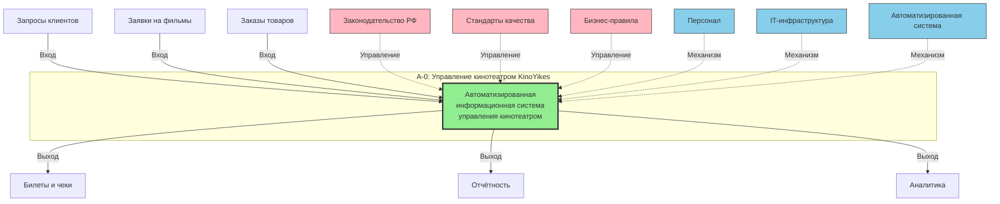
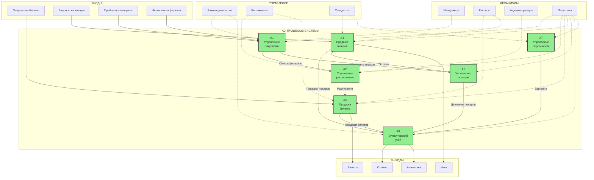
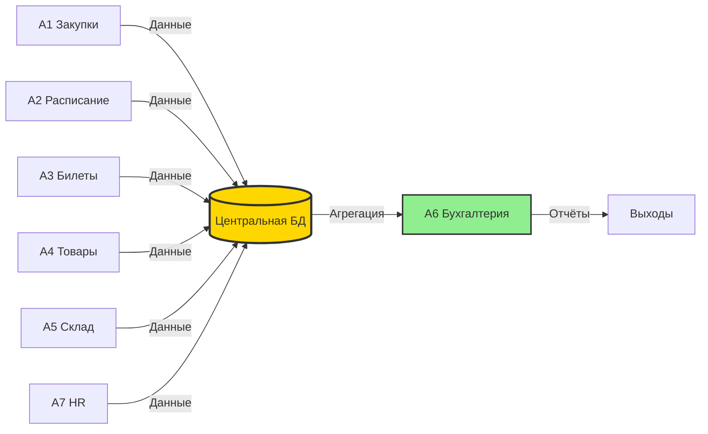

# Практическая работа № 5

## Построение диаграммы деятельности организации в нотации DFD (IDEF0)

**Тема:** 1.13. Разработка информационной системы "KinoYikes"

**Реализация подсистем:** Отдел закупок, Отдел продаж, Склад, Отдел кадров, Бухгалтерия

---

## Цели работы

1.1. Закрепить теоретические знания по принципам создания диаграммы деятельности.

1.2. Получить практические навыки по построению диаграммы деятельности в нотации DFD (IDEF0).

---

## Описание предметной области

**KinoYikes** — это сеть кинотеатров, которая организует показ фильмов и обеспечивает весь сопутствующий сервис: продажу билетов, работу баров и сувенирных лавок, проведение премьер и специальных мероприятий.

### Основные процессы организации:

1. **Закупка прав на фильмы и товаров** - менеджер по закупкам организует заказы у поставщиков
2. **Формирование расписания сеансов** - администратор создаёт расписание показов фильмов
3. **Продажа билетов** - кассиры продают билеты клиентам офлайн и онлайн
4. **Продажа сопутствующих товаров** - продажа попкорна, напитков, сувениров
5. **Управление складом** - учёт остатков товаров и их движение
6. **Бухгалтерский учёт** - финансовый учёт всех операций и расчёт зарплаты
7. **Управление персоналом** - найм, обучение и учёт сотрудников

---

## Диаграммы TO-BE в нотации IDEF0

### Контекстная диаграмма TO-BE A-0

**Описание контекстной диаграммы A-0:**

**Входы (Input):**
- Запросы клиентов на билеты и товары
- Заявки на лицензии фильмов от дистрибьюторов
- Заказы на товары от поставщиков

**Управление (Control):**
- Законодательство РФ (налоговое, трудовое)
- Стандарты качества обслуживания
- Бизнес-правила и регламенты компании

**Механизмы (Mechanism):**
- Персонал кинотеатра (кассиры, администраторы, менеджеры)
- IT-инфраструктура (серверы, сеть, оборудование)
- Автоматизированная информационная система

**Выходы (Output):**
- Билеты с QR-кодами и чеки
- Налоговая и финансовая отчётность
- Аналитические отчёты для руководства

---

### Диаграмма декомпозиции TO-BE A0

**Описание диаграммы декомпозиции A0:**

### Процесс A1: Управление закупками

**Входы:**
- Прайс-листы от поставщиков (API)
- Лицензионные предложения на фильмы от дистрибьюторов

**Управление:**
- Законодательство о закупках
- Регламенты взаимодействия с поставщиками
- Бюджетные ограничения

**Механизмы:**
- Менеджер по закупкам
- Автоматизированная система прогнозирования
- AI-модуль анализа потребностей

**Выходы:**
- Список доступных фильмов → A2
- Данные о закупленных товарах → A5
- Информация о затратах → A6

**Функции:**
- Автоматический мониторинг остатков
- AI-прогнозирование потребностей
- Электронное согласование заказов
- API-интеграция с поставщиками

---

### Процесс A2: Управление расписанием

**Входы:**
- Список доступных фильмов (от A1)
- Данные о популярности фильмов

**Управление:**
- Регламенты формирования расписания
- Требования к интервалам между сеансами
- Правила распределения по залам

**Механизмы:**
- Администраторы
- Система оптимизации расписания
- Алгоритмы планирования

**Выходы:**
- Расписание сеансов → A3
- План загрузки залов → Аналитика

**Функции:**
- Интеллектуальное формирование расписания
- Оптимизация загрузки залов
- Учёт технических требований
- Автоматическое распределение сеансов

---

### Процесс A3: Продажа билетов

**Входы:**
- Запросы клиентов на билеты
- Расписание сеансов (от A2)

**Управление:**
- Стандарты обслуживания клиентов
- Правила ценообразования
- Регламенты возвратов

**Механизмы:**
- Кассиры
- Веб-приложение
- Мобильное приложение
- Платёжные шлюзы

**Выходы:**
- Электронные билеты с QR-кодами → Клиенты
- Данные о продажах → A6

**Функции:**
- Онлайн-продажа 24/7
- Интерактивная схема зала
- Автоматическое бронирование
- QR-билеты на email/SMS

---

### Процесс A4: Продажа товаров

**Входы:**
- Запросы клиентов на товары
- Данные об остатках (от A5)

**Управление:**
- Стандарты качества продукции
- Правила ценообразования
- Санитарные нормы

**Механизмы:**
- Кассиры/Бармены
- POS-терминалы
- Система управления продажами

**Выходы:**
- Электронные чеки → Клиенты
- Данные о продажах → A6
- Списание товаров → A5

**Функции:**
- Онлайн-заказ товаров
- Предзаказ перед сеансом
- Автоматическое списание со склада
- Интеграция с POS

---

### Процесс A5: Управление складом

**Входы:**
- Данные о закупленных товарах (от A1)
- Данные о продажах (от A4)

**Управление:**
- Правила складского учёта
- Нормы хранения
- Регламенты инвентаризации

**Механизмы:**
- Кладовщик
- Система автоматического учёта
- RFID/штрих-кодирование

**Выходы:**
- Актуальные остатки → A4
- Уведомления о критических остатках → A1
- Данные о движении товаров → A6

**Функции:**
- Учёт в реальном времени
- Автоматическое обновление остатков
- Система уведомлений
- ABC/XYZ анализ

---

### Процесс A6: Бухгалтерский учёт

**Входы:**
- Данные о продажах билетов (от A3)
- Данные о продажах товаров (от A4)
- Данные о закупках (от A1)
- Данные о движении товаров (от A5)
- Данные о зарплате (от A7)

**Управление:**
- Налоговое законодательство
- Бухгалтерские стандарты
- Учётная политика компании

**Механизмы:**
- Бухгалтер
- Система автоматизированного учёта
- Модуль формирования отчётности

**Выходы:**
- Налоговая отчётность → ФНС
- Финансовые отчёты → Руководство
- Аналитические дашборды → Менеджмент

**Функции:**
- Автоматический сбор всех данных
- Автоматический расчёт налогов
- Формирование отчётов в 1 клик
- Электронная отчётность через СБИС

---

### Процесс A7: Управление персоналом

**Входы:**
- Заявки на подбор персонала
- Данные о рабочем времени

**Управление:**
- Трудовое законодательство
- Стандарты обслуживания
- Корпоративные правила

**Механизмы:**
- HR-специалист
- Система электронного кадрового учёта
- Модуль расчёта зарплаты

**Выходы:**
- Расчёт зарплаты → A6
- Кадровая отчётность → Руководство
- Данные об эффективности → Аналитика

**Функции:**
- Цифровое досье сотрудников
- Автоматический учёт рабочего времени
- Электронные документы
- Оценка эффективности

---

## Ключевые особенности TO-BE

### Преимущества автоматизации

| **Аспект** | **Описание** |
|------------|--------------|
| **Входы** | Цифровые каналы приёма данных (API, веб-формы, мобильные приложения) |
| **Управление** | Автоматический контроль соблюдения правил и регламентов |
| **Процессы** | Автоматизация 80% рутинных операций |
| **Механизмы** | IT-системы как основной механизм, персонал для контроля |
| **Выходы** | Электронные документы, автоматическая отчётность |

### Информационные потоки

Все процессы интегрированы через централизованную базу данных, что обеспечивает:
- Единую точку правды
- Консистентность данных
- Обновление в реальном времени
- Отсутствие дублирования

---

## Выводы

В данной практической работе были получены практические навыки по построению диаграмм деятельности в нотации IDEF0 и закреплены знания по принципам создания таких диаграмм.

### Основные результаты:

1. **Построена контекстная диаграмма TO-BE (уровень A-0)** в нотации IDEF0, показывающая автоматизированную систему управления кинотеатром с четким разделением на:
   - **Входы** - запросы и данные от внешних сущностей
   - **Управление** - законодательство, стандарты и регламенты
   - **Механизмы** - персонал и IT-инфраструктура
   - **Выходы** - билеты, отчётность, аналитика

2. **Создана диаграмма декомпозиции TO-BE (уровень A0)** с детализацией на 7 автоматизированных процессов:
   - A1 - Управление закупками (с AI-прогнозированием)
   - A2 - Управление расписанием (оптимизация загрузки)
   - A3 - Продажа билетов (онлайн 24/7)
   - A4 - Продажа товаров (интеграция с POS)
   - A5 - Управление складом (учёт в реальном времени)
   - A6 - Бухгалтерский учёт (автоматическая отчётность)
   - A7 - Управление персоналом (электронные досье)

3. **Для каждого процесса определены:**
   - Входящие информационные потоки
   - Управляющие воздействия (регламенты, законы)
   - Используемые механизмы (люди и системы)
   - Выходящие информационные потоки и документы

4. **Показана интеграция процессов** через централизованную базу данных, обеспечивающую:
   - Единое информационное пространство
   - Консистентность и актуальность данных
   - Автоматический обмен информацией между процессами

### Ключевые преимущества TO-BE:

✅ **Автоматизация** - снижение ручного труда на 80%

✅ **Цифровизация** - электронный документооборот, онлайн-сервисы

✅ **Интеграция** - единая система вместо разрозненных приложений

✅ **Аналитика** - данные для принятия решений в реальном времени

✅ **Масштабируемость** - система растёт вместе с бизнесом

Разработанная модель TO-BE обеспечивает комплексную автоматизацию всех бизнес-процессов сети кинотеатров KinoYikes в соответствии с нотацией IDEF0, что приводит к значительному повышению операционной эффективности и улучшению качества обслуживания клиентов.

---

**© 2025 Практическая работа №5 | Информационная система KinoYikes | IDEF0 диаграммы TO-BE**
