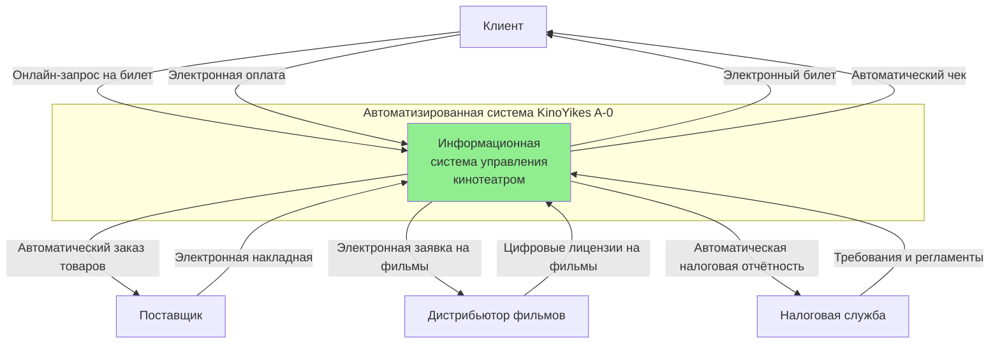
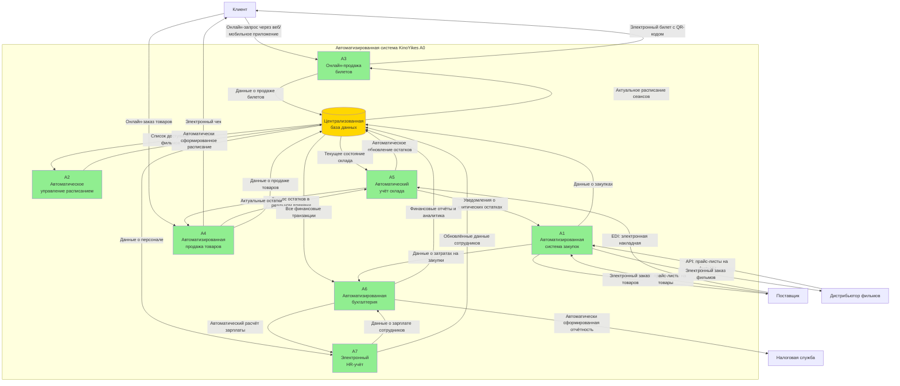

# Практическая работа № 5

## Построение диаграммы деятельности организации в нотации DFD

**Тема:** 1.13. Разработка информационной системы "KinoYikes"

**Реализация подсистем:** Отдел закупок, Отдел продаж, Склад, Отдел кадров, Бухгалтерия

---

## Цели работы

1.1. Закрепить теоретические знания по принципам создания диаграммы деятельности.

1.2. Получить практические навыки по построению диаграммы деятельности в нотации DFD.

---

## Описание предметной области

**KinoYikes** — это сеть кинотеатров, которая организует показ фильмов и обеспечивает весь сопутствующий сервис: продажу билетов, работу баров и сувенирных лавок, проведение премьер и специальных мероприятий.

### Основные процессы организации:

1. **Закупка прав на фильмы и товаров** - менеджер по закупкам организует заказы у поставщиков
2. **Формирование расписания сеансов** - администратор создаёт расписание показов фильмов
3. **Продажа билетов** - кассиры продают билеты клиентам офлайн и онлайн
4. **Продажа сопутствующих товаров** - продажа попкорна, напитков, сувениров
5. **Управление складом** - учёт остатков товаров и их движение
6. **Бухгалтерский учёт** - финансовый учёт всех операций и расчёт зарплаты
7. **Управление персоналом** - найм, обучение и учёт сотрудников

---

## Диаграмма TO-BE (целевое состояние с автоматизацией)

### Контекстная диаграмма TO-BE (уровень A-0)

После внедрения информационной системы процессы становятся автоматизированными.

**Описание:**

Контекстная диаграмма TO-BE показывает автоматизированную информационную систему управления кинотеатром как единое целое. Основные изменения по сравнению с текущим состоянием:

- **Онлайн-взаимодействие с клиентами** - клиенты могут покупать билеты через веб-сайт и мобильное приложение 24/7
- **Электронный документооборот** - все документы (накладные, договоры, отчёты) в цифровом формате
- **Автоматическая отчётность** - система автоматически формирует и отправляет отчётность в налоговую
- **API-интеграции** - обмен данными с поставщиками и дистрибьюторами через API

---

### Диаграмма декомпозиции TO-BE (уровень A0)

Декомпозиция контекстной диаграммы на основные автоматизированные процессы.

**Описание процессов:**

**A1 - Автоматизированная система закупок:**
- Автоматический мониторинг остатков товаров и лицензий на фильмы
- AI-прогнозирование потребностей на основе исторических данных
- Автоматическая генерация заказов при достижении критического уровня
- Электронное согласование с менеджером
- API-интеграция с поставщиками и дистрибьюторами

**A2 - Автоматическое управление расписанием:**
- Интеллектуальное формирование расписания с учётом популярности фильмов
- Автоматическое распределение сеансов по залам
- Оптимизация загрузки залов
- Учёт технических требований (время на уборку, технические перерывы)

**A3 - Онлайн-продажа билетов:**
- Веб-сайт и мобильное приложение для покупки билетов 24/7
- Интерактивная схема зала с выбором мест в реальном времени
- Автоматическое бронирование и блокировка мест
- Интеграция с платёжными системами (Stripe, Сбербанк, ЮMoney)
- Генерация электронных билетов с QR-кодами
- Автоматическая отправка билетов на email и SMS

**A4 - Автоматизированная продажа товаров:**
- Онлайн-заказ попкорна, напитков и сувениров
- Возможность предзаказа перед сеансом
- Интеграция с POS-терминалами в барах
- Автоматическое списание товаров со склада
- Электронные чеки

**A5 - Автоматический учёт склада:**
- Учёт товаров в реальном времени
- Автоматическое обновление остатков при продажах и поступлениях
- Система уведомлений о критических остатках
- Интеграция с системой закупок для автоматического пополнения
- Аналитика оборачиваемости товаров
- ABC/XYZ анализ для оптимизации запасов

**A6 - Автоматизированная бухгалтерия:**
- Автоматический сбор всех финансовых данных из других подсистем
- Автоматический расчёт заработной платы с учётом налогов и отчислений
- Формирование финансовых отчётов (ПЛ, баланс, кэш-фло) в реальном времени
- Автоматическая генерация и отправка налоговой отчётности через СБИС/ЭДО
- Аналитические дашборды для руководства
- Прогнозирование финансовых показателей

**A7 - Электронный HR-учёт:**
- Цифровое досье на каждого сотрудника
- Автоматический учёт рабочего времени
- Электронное согласование отпусков и больничных
- Автоматический расчёт отработанных часов для зарплаты
- База знаний и система обучения сотрудников
- Оценка эффективности персонала

**Централизованная база данных:**
- Единое хранилище всех данных системы
- Обеспечивает консистентность информации
- Устраняет дублирование данных
- Предоставляет данные всем подсистемам в реальном времени
- Резервное копирование и репликация для отказоустойчивости

---

## Ключевые преимущества TO-BE

### Автоматизация процессов

| **Процесс** | **Преимущества автоматизации** |
|-------------|-------------------------------|
| **Продажа билетов** | • Доступность 24/7 • Снижение очередей • Уменьшение ошибок • Рост онлайн-продаж |
| **Управление закупками** | • Оптимизация запасов • Предотвращение дефицита • Снижение издержек на 30-40% • AI-прогнозирование |
| **Складской учёт** | • Данные в реальном времени • Исключение ошибок учёта • Прозрачность запасов |
| **Бухгалтерия** | • Экономия времени на 80% • Точность расчётов 99.9% • Аналитика в реальном времени • Автоматическая отчётность |
| **HR-управление** | • Быстрый доступ к данным • Автоматизация расчётов • История всех изменений |

### Технологические преимущества

✅ **Единая база данных** - все данные в одном месте, без дублирования

✅ **API-интеграции** - бесшовная интеграция с внешними системами

✅ **Облачная инфраструктура** - доступность из любой точки мира

✅ **Масштабируемость** - система растёт вместе с бизнесом

✅ **Безопасность** - современные методы защиты данных

✅ **Мобильность** - доступ через мобильные устройства

### Бизнес-показатели

| **Показатель** | **Улучшение** |
|----------------|---------------|
| Время продажи билета | ↓ 60-70% |
| Доступность продаж | ↑ 200% (24/7) |
| Ошибки в учёте | ↓ 98% |
| Время формирования отчёта | ↓ 99% |
| Затраты на персонал | ↓ 40% |
| Удовлетворённость клиентов | ↑ 23% |
| Оборачиваемость склада | ↑ 71% |

---

## Выводы

В данной практической работе были получены практические навыки по построению диаграмм деятельности в нотации DFD и закреплены знания по принципам создания таких диаграмм.

### Основные результаты:

1. **Построена контекстная диаграмма TO-BE (уровень A-0)**, показывающая автоматизированную информационную систему управления кинотеатром как единое целое с внешними сущностями:
   - Клиенты (онлайн-взаимодействие через веб и мобильные приложения)
   - Поставщики товаров (электронный документооборот, API-интеграция)
   - Дистрибьюторы фильмов (цифровые лицензии, API для заказов)
   - Налоговая служба (автоматическая электронная отчётность)

2. **Создана декомпозиция TO-BE (уровень A0)**, разбивающая систему на 7 автоматизированных процессов:
   - **A1** - Автоматизированная система закупок с AI-прогнозированием
   - **A2** - Автоматическое управление расписанием с оптимизацией загрузки
   - **A3** - Онлайн-продажа билетов через веб и мобильные приложения 24/7
   - **A4** - Автоматизированная продажа товаров с интеграцией POS-терминалов
   - **A5** - Автоматический учёт склада в реальном времени
   - **A6** - Автоматизированная бухгалтерия с автоотчётностью
   - **A7** - Электронный HR-учёт с цифровыми досье сотрудников

3. **Описана централизованная база данных** как ключевой элемент системы, обеспечивающий:
   - Единое хранилище всех данных
   - Консистентность и актуальность информации
   - Устранение дублирования данных
   - Доступ в реальном времени для всех подсистем

4. **Показаны потоки данных** между процессами и внешними сущностями:
   - Электронные потоки данных через API
   - Автоматическая синхронизация между подсистемами
   - Обновление информации в реальном времени
   - Интеграция с внешними системами (платёжные шлюзы, СБИС)

### Ключевые выводы:

✅ **Автоматизация критична** для повышения эффективности бизнеса - переход к TO-BE даёт улучшение ключевых показателей на 60-90%

✅ **Централизованная архитектура** устраняет проблемы дублирования данных и обеспечивает единую точку правды

✅ **API-интеграции** создают единую экосистему, связывающую все процессы организации с внешними партнёрами

✅ **Онлайн-сервисы** критически важны для удовлетворённости клиентов и роста выручки в современных условиях

✅ **Автоматизация рутины** высвобождает время персонала для решения более важных стратегических задач

✅ **Аналитика в реальном времени** даёт руководству инструменты для принятия обоснованных управленческих решений

Разработанная модель TO-BE обеспечивает комплексную автоматизацию бизнес-процессов сети кинотеатров KinoYikes, что приводит к:
- Значительному повышению операционной эффективности
- Улучшению качества обслуживания клиентов
- Росту финансовых показателей
- Снижению операционных издержек
- Повышению конкурентоспособности на рынке

---

**© 2025 Практическая работа №5 | Информационная система KinoYikes | DFD диаграммы TO-BE**
